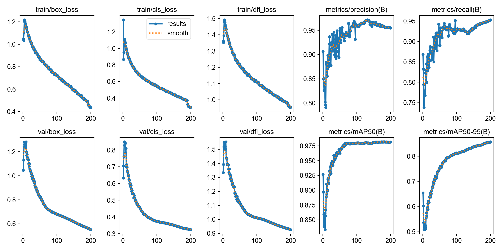
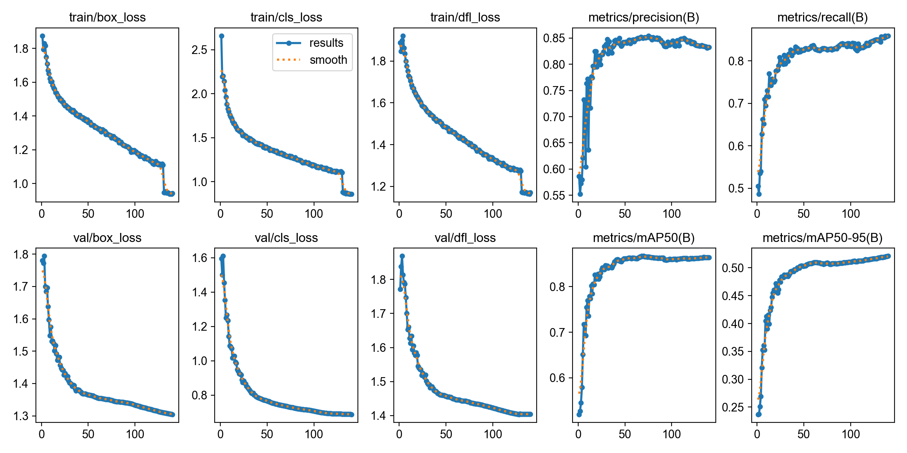

# 无人机溺水检测（Drone Rescue Detection）

> YOLO 目标检测 + TCN 时序分类的溺水识别系统：覆盖**数据标注 → 离线增强 → YOLO 训练 → 实时检测 → 轨迹分类**完整链路。
>
> 本仓库是内部工作目录的**可发布快照**（`v1.0.0-snapshot`），只含源码、配置、示例轨迹标注与训练指标记录；
> 数据集图像、视频与模型权重不入库。改动清单见 [CHANGELOG.md](CHANGELOG.md)。

[](LICENSE)

---

## English summary

An UAV / fixed-camera **drowning detection** pipeline built on two stages:

1. **YOLO (Ultralytics, v8/n/s)** detects `Swimming` / `Drowning` / `Person out of water` per frame,
   with a custom *water-ripple* offline augmentation (`WaterRipple`) and online hyper-parameter search configs.
2. **TCN stage**: a Kalman + IoU tracker turns detections into per-person tracks; each track is cropped and
   encoded by a frozen **MobileNetV2**, fed through a **multi-scale dilated causal TCN with CBAM-1D attention**,
   then a **graph-interaction** module aggregates neighbouring swimmers and a **gated fusion** head combines the
   temporal probability with the YOLO confidence to make the final call.

Includes offline detection with JSON/CSV reports, an optional cloud alert webhook, online continual-learning hooks,
and optional quantisation / TorchScript acceleration. Best reported run: **mAP@50 = 0.982, mAP@50:95 = 0.857**
(see [实验结果](#实验结果) for the full 11-run table and its caveats).

Licensed under **AGPL-3.0** (matching the `ultralytics` dependency). Datasets and weights are **not** redistributed.

---

## 目录

- [它解决什么问题](#它解决什么问题)
- [系统结构](#系统结构)
- [仓库结构](#仓库结构)
- [环境准备](#环境准备)
- [权重与数据获取](#权重与数据获取)
- [快速开始](#快速开始)
- [方法说明](#方法说明)
- [实验结果](#实验结果)
- [部署与二次开发](#部署与二次开发)
- [自检与验证](#自检与验证)
- [已知限制](#已知限制)
- [许可证与声明](#许可证与声明)

---

## 它解决什么问题

单帧目标检测在水面场景里很容易误判：浪花、遮挡、俯视小目标都会让「溺水」和「游泳」在**单帧上几乎无法区分**。
本项目的做法是把两者拆开：

| 阶段 | 输入 | 输出 | 判据 |
| --- | --- | --- | --- |
| YOLO 检测 | 单帧 | 目标框 + 类别置信度 | 外观 |
| TCN 分类 | 同一目标连续 16 帧的特征序列 | 正常 / 溺水 | **时序运动模式** |

再叠一层**同帧多目标的图交互**（附近的人一起异常，说明可能是集体挣扎）和
**YOLO 置信度门控融合**（检测不确定时更相信时序，检测确定时更相信外观）。

---

## 系统结构

```text
        视频流 / 摄像头 / RTSP / 本地文件
                        │
              ┌─────────▼──────────┐
              │  YOLO 检测 (ultralytics)   │  → 单帧告警、框绘制、JSON/CSV 报告
              └─────────┬──────────┘
              ┌─────────▼──────────┐
              │ 卡尔曼 + IoU 跟踪           │  → 每个目标一条轨迹 track_id/frames/bboxes
              └─────────┬──────────┘
        ┌───────────────▼────────────────┐
        │ MobileNetV2（冻结）逐帧 bbox 特征 │  1280 维 / 帧
        └───────────────┬────────────────┘
        ┌───────────────▼────────────────┐
        │ 多尺度因果 TCN（膨胀 1/2/4）      │  深度可分离 + CBAM-1D 注意力 + 残差
        └───────────────┬────────────────┘
        ┌───────────────▼────────────────┐
        │ 图交互 GraphInteraction          │  同帧多目标按距离高斯加权聚合
        ├───────────────┬────────────────┤
        │ 门控融合 GatedFusion + 判决      │  → 溺水告警 / 在线学习 / 云端 POST
        └───────────────┬────────────────┘
             可选：INT8 动态量化 · TorchScript · 光流多模态
```

完整伪代码见 [`docs/algorithm_pseudocode.txt`](docs/algorithm_pseudocode.txt)。

---

## 仓库结构

```text
drone-rescue-detection/
├── src/
│   ├── detection/
│   │   ├── main.py              # YOLO 单帧检测器：画框、存溺水帧、JSON+CSV 报告
│   │   └── test.py              # 同上的变体：暂停/续播、云端告警 POST
│   └── training/
│       ├── yolo/
│       │   ├── train.py         # YOLO 训练入口（路径自适应 + argparse）
│       │   ├── data.yaml        # 数据集配置（path 相对项目根，可用 DRONE_DATA_ROOT 覆盖）
│       │   ├── hyp_strong.yaml  # 在线增强超参（以 cfg= 传给 ultralytics）
│       │   ├── custom_augs.py   # WaterRipple 水面波纹自定义增强
│       │   ├── offline_augment.py  # 离线增强：images/train → images/train_aug
│       │   └── exam.py          # 环境自检（torch/CUDA/依赖/数据集/TorchScript）
│       └── tcn/
│           ├── model_def.py     # 模型定义 + YOLO&TCN 推理器（量化/TorchScript/光流/在线学习）
│           ├── generate_tracks.py      # ① 视频 → 跟踪 → 轨迹 JSON
│           ├── label_tracks.py         # ② 轨迹人工标注（0 正常 / 1 溺水）
│           ├── manual_label_drowning.py # 手动框选关键帧 + 线性插值生成轨迹
│           ├── extract_features.py     # ③ 轨迹 + 视频 → MobileNetV2 特征序列 train.pt
│           └── train_tcn.py            # ④ 训练 TCN → tcn_drowning.pth
├── data/
│   ├── tracks/reservoir_drowning/  # ✅ 随包提供的示例轨迹标注（4 条，均为正样本）
│   └── README.md                   # 数据集放置说明
├── weights/{yolo,tcn}/          # 权重目录（.pt/.pth 不入库）
├── outputs/runs/detect/         # 11 组 YOLO 实验的 results.csv / results.png / args.yaml
├── docs/                        # 数据集规范、算法伪代码
├── scripts/run_label_studio.bat # Label Studio 启动脚本
├── requirements.txt
├── CHANGELOG.md
└── LICENSE                      # AGPL-3.0
```

---

## 环境准备

| 项 | 要求 |
| --- | --- |
| Python | 3.10 – 3.13（推荐）。**3.14 可用**，但 Label Studio 与 TorchScript 有额外限制，见[已知限制](#已知限制) |
| 显存 | 训练 yolov8s @ imgsz=640 / batch=12 约需 8 GB；推理 4 GB 可跑 |
| CUDA | 开发环境为 torch 2.9.0+cu126（驱动 ≥ 525） |

```bash
# 1) 建环境
python -m venv .venv
#   Windows: .venv\Scripts\activate     Linux/macOS: source .venv/bin/activate

# 2) 先装 CUDA 版 torch（可选，直接 pip install -r 会装 CPU 版）
pip install torch torchvision --index-url https://download.pytorch.org/whl/cu126

# 3) 装其余依赖
pip install -r requirements.txt

# 4) 自检（GPU / 依赖版本 / 数据集是否就位）
python src/training/yolo/exam.py
```

`exam.py` 会逐项打印 `[OK] / [FAIL]`，包括 albumentations 是否 ≥2.0（`WaterRipple` 的硬要求）
以及当前解释器能否使用 `torch.jit.script`。

## 权重与数据获取

**权重**（不入库，`.gitignore` 已排除 `*.pt` / `*.pth`）：

- 预训练底座：`yolov8n.pt` / `yolov8s.pt` / `yolo11n.pt` 由 ultralytics 自动下载到默认缓存，
  也可手动放到 `weights/yolo/`。
- 自己训练的模型：`outputs/runs/detect/<实验名>/weights/best.pt`。
- TCN 模型：`weights/tcn/tcn_drowning.pth`（需自行训练，见下）。

**数据集**（不入库）：按 [`docs/dataset_layout.md`](docs/dataset_layout.md) 的布局放到
`data/drowning-DST1005/`（或任意目录后用 `data.yaml` 的 `path` / 环境变量 `DRONE_DATA_ROOT` 指过去）。
本项目使用的是公开的溺水检测标注集（Roboflow 生态的 DST1005 一类数据），
**本仓库不重新分发图像**，请按你实际下载来源的许可使用。

---

## 快速开始

### 1. 只做检测（最快看到效果）

```bash
# 摄像头 0，实时显示
python src/detection/main.py --model outputs/runs/detect/train-2/weights/best.pt --source 0

# 视频文件 → 输出带框视频 + 溺水帧截图 + JSON/CSV 报告
python src/detection/main.py --model <best.pt> --source pool/13.mp4 \
       --output out/result.mp4 --save-dir outputs/drowning_frames \
       --output-dir outputs/reports --conf 0.7 --no-display
```

常用参数：`--source` 摄像头序号 / 视频路径 / RTSP URL，`--conf` 阈值，`--imgsz` 推理尺寸，
`--no-display` 无界面模式（服务器上用）。

### 2. 训练 YOLO

```bash
# 用默认配置（weights/yolo/yolov8s.pt + data.yaml + hyp_strong.yaml）
python src/training/yolo/train.py

# 常用覆盖
python src/training/yolo/train.py --weights weights/yolo/yolov8n.pt \
       --epochs 100 --batch 16 --device 0 --name my_exp

# 数据集不在默认位置
DRONE_DATA_ROOT=/data/drowning-DST1005 python src/training/yolo/train.py   # Linux
set DRONE_DATA_ROOT=E:/datasets/drowning-DST1005 && src\training\yolo\train.py  # Windows
```

产物写入 `outputs/runs/detect/<name>/`（含 `weights/best.pt`、`results.csv`、曲线图）。
脚本会先生成一份 **path 已解析为绝对路径**的配置副本到 `outputs/runs/detect/_config/`，
因为 ultralytics 对相对 `path` 是按它自己的 `DATASETS_DIR` 解析的——这是个容易踩的坑，已在脚本里处理掉。

**先做离线增强**（可选，但这是 `dual_aug_*` 系列的设置）：

```bash
python src/training/yolo/offline_augment.py --data-root data/drowning-DST1005 --num-aug 3
# → data/drowning-DST1005/images/train_aug + labels/train_aug，data.yaml 已包含该 split
```

### 3. 训练 TCN（四步链路）

```bash
# ① 视频 → 轨迹（默认只跟 person 类，COCO 模型 id=0）
python src/training/tcn/generate_tracks.py \
       --video pool/reservoir_01.mp4 --yolo-model weights/yolo/yolov8n.pt \
       --output data/tracks/reservoir_01.json --conf 0.5 --min-frames 16

# ② 人工标注轨迹：窗口里逐条按 0 / 1 / s / q
python src/training/tcn/label_tracks.py pool/reservoir_01.mp4 data/tracks/reservoir_01.json
# → data/tracks/reservoir_01_labeled.json

# ②'（备选）检测漏了就用手动框选关键帧 + 线性插值补一条正样本轨迹
python src/training/tcn/manual_label_drowning.py pool/reservoir_01.mp4 2340 3400 \
       data/tracks/manual_1.json --keyframe_interval 10

# ③ 轨迹 + 视频 → 特征序列（X: N×1280×16, y, C=窗口平均置信度）
python src/training/tcn/extract_features.py \
       --tracks data/tracks --video-root pool --out weights/tcn/train.pt --window 16

# ④ 训练 TCN
python src/training/tcn/train_tcn.py --data weights/tcn/train.pt \
       --out weights/tcn/tcn_drowning.pth --epochs 60 --device 0
```

⚠️ 随包的 4 条示例轨迹**全是正样本（label=1）**，跑 ③④ 只会产出「恒判溺水」的模型。
要真正训练，必须自己补一批 `label=0` 的正常游泳轨迹（`extract_features.py` 会打印类别数并警告）。

### 4. 用 TCN 做检测（YOLO + 时序联合判决）

```bash
python src/training/tcn/model_def.py \
       --yolo-model outputs/runs/detect/train-2/weights/best.pt \
       --tcn-model  weights/tcn/tcn_drowning.pth \
       --source 0 --conf 0.5 --window-size 16 --imgsz 640
```

推理器（`DrowningDetector`，在 `model_def.py` 里）额外支持：
`--quantize`（CPU INT8 动态量化）、`--torchscript`、`--flow`（光流多模态）、`--no-graph`（关掉图交互）。

---

## 方法说明

### YOLO 侧的增强策略

| 层次 | 手段 | 位置 |
| --- | --- | --- |
| 在线 | mosaic 0.5 / mixup 0.1 / copy_paste 0.15、旋转 10°、翻转、HSV | `hyp_strong.yaml`（以 `cfg=` 传给 ultralytics，其键会被合并进训练参数） |
| 离线 | **WaterRipple** 正弦位移场模拟水面折射 + 翻转/亮度/色相/模糊/ISO 噪声 | `custom_augs.py` + `offline_augment.py` |

`WaterRipple` 同时实现 `apply` / `apply_to_bboxes` / `apply_to_keypoints`，
在像素域用同一套位移公式，保证图像与标注严格同步
（原实现按 albumentations 1.x 的 `rows/cols` 约定写，在 2.x 下会**静默丢掉全部标注**，见 CHANGELOG）。

### TCN 侧

- **主干**：MobileNetV2（`feature_dim=1280`），训练/推理均**冻结**，只做逐 bbox 特征提取。
  输入按 letterbox 到 224×224 并做 ImageNet 归一化。
- **因果性**：`CausalConv1d` 用「前端 padding + 切片」实现，任意时刻只用过去信息，可流式推理。
- **多尺度**：每个 TCN block 内并行 dilation 1/2/4 的深度可分离分支，1×1 投影后求和 + 残差。
- **注意力**：`CBAM1D`（通道注意力 + 时间维空间注意力）。
- **图交互**：`A[i,j] = exp(-‖c_i-c_j‖ / σ)`（σ=100），同帧目标按距离高斯加权聚合邻居特征。
  仅在**同批多目标**时有意义，因此离线训练默认不启用，checkpoint 会记录该开关。
- **门控融合**：`g = σ(W·[y_conf, p_tcn])`，`z = g⊙ReLU(W_y·y_conf) + (1-g)⊙ReLU(W_t·p_tcn)`。
- **在线学习**：确认过的告警帧（置信度 ≥0.85）回灌样本池，每 100 条做一次单步更新
  （`update_online()`），并可导出 `learned_corrections.pth`。
- **跟踪**：卡尔曼（恒速模型）+ 贪心 IoU 匹配（阈值 0.3），`max_age=30` / `min_hits=3`。

---

## 实验结果

11 组 YOLO 实验的**完整记录已随仓库发布**（`outputs/runs/detect/<run>/{results.csv,results.png,args.yaml}`）。
下表取**每个 run 中 mAP@50:95 最高的那个 epoch** 的指标：

| 实验 | 起始权重 | epochs（最优） | batch | freeze | P | R | mAP@50 | mAP@50:95 |
| --- | --- | --- | --- | --- | --- | --- | --- | --- |
| **train-2** | ← train6 best.pt | 200 (200) | 12 | – | 0.954 | 0.953 | **0.982** | **0.857** |
| train5 | ← train4 best.pt | 30 (30) | 3 | – | 0.942 | 0.858 | 0.935 | 0.710 |
| train6 | yolov8s.pt | 300 (296) | 3 | – | 0.833 | 0.882 | 0.907 | 0.608 |
| train4 | ← train3 best.pt | 60 (45) | 3 | – | 0.844 | 0.841 | 0.901 | 0.591 |
| train2 | ← train best.pt | 70 (70) | 3 | – | 0.864 | 0.817 | 0.889 | 0.577 |
| train3 | ← train2 best.pt | 50 (48) | 3 | – | 0.886 | 0.800 | 0.883 | 0.576 |
| dual_aug_exp2 | ← dual_aug_exp1 best.pt | 50 (50) | 12 | 10 | 0.881 | 0.814 | 0.901 | 0.543 |
| dual_aug_exp1 | yolov8n.pt | 80 (80) | 12 | 10 | 0.853 | 0.817 | 0.887 | 0.533 |
| train | yolov8s.pt | 80 (78) | 3 | – | 0.864 | 0.784 | 0.856 | 0.531 |
| dual_aug_exp3 | yolov8s.pt | 140 (140) | 12 | 10 | 0.833 | 0.859 | 0.864 | 0.521 |
| dual_aug_exp | yolov8n.pt | 100 (100) | 12 | 10 | 0.822 | 0.784 | 0.834 | 0.484 |

**读表须知（重要，别直接引用数字）**：

1. 大量 run 是**从上一个 run 的 `best.pt` 继续训练**的（表中「←」表示 warm-start），
   所以「起始权重 + epochs」并不是独立的实验条件，跨行比较意义有限。
   `train-2` 的 0.857 是在已充分训练的模型上再跑 200 epoch 的结果，不等于「本方法在 DST1005 上能到 0.857」。
2. 训练数据来自**视频抽帧**，`train` 与 `valid` 之间可能存在近似重复帧，指标偏乐观；
   正式汇报前应做跨视频切分（同一视频帧不得同时出现在 train/val）再重跑。
3. 类别分布不均衡，且 `train_aug` 与 `train` 同时进入训练集，样本量以图像数计而非独立场景数。
4. `dual_aug_*` 系列（离线 WaterRipple + 在线强增强 + freeze backbone + 余弦退火）在这批数据上
   **没有跑赢**普通 run。可能原因是增强强度对小数据集过强，也可能只是 warm-start 差异掩盖了效果——
   这批实验不足以支撑「水面波纹增强有效」的结论，请把它当作待验证假设。
5. 表中指标为 **3 类整体 mAP**，不是单独 `Drowning` 类的指标（逐类指标需重跑 `yolo val`）。

`train-2`（最佳 mAP）与 `dual_aug_exp3`（增强实验组）的训练曲线：

| train-2 | dual_aug_exp3 |
| --- | --- |
|  |  |

TCN 侧目前没有可发布的量化结果：示例轨迹只有正样本，训练集不完整，
`weights/tcn/` 因而为空。这是数据问题，不是结构问题。

---

## 部署与二次开发

**云端告警**（`src/detection/test.py`）：检测到溺水时异步 POST（不阻塞视频循环，`timeout=5`）

```bash
python src/detection/test.py --model <best.pt> --source 0 \
       --enable-api --api-url http://your-server:8000/api/drowning/alert
```

payload 形如：

```json
{"timestamp": "2026-07-29T10:00:00", "drowning_count": 1,
 "detections": [{"bbox": [x1, y1, x2, y2], "confidence": 0.91}]}
```

**接自己的告警通道**：给 `DrowningDetector(alert_callback=fn)` 传回调。
注意三个实现的签名不同——`detection/main.py` 与 `training/tcn/model_def.py` 会传
`(frame, detections, saved_path)`，`detection/test.py` 只传 `(frame, detections)`。

**做成服务**：`src/training/tcn/model_def.py` 里的 `DrowningDetector` 是一个普通 Python 类，
把它包进 FastAPI + `cv2.VideoCapture` 循环即可；启用 `--quantize`（CPU）或 `--torchscript` 可显著降低延迟。

**标注**：`scripts/run_label_studio.bat`（图片根目录用 `LABEL_STUDIO_DOC_ROOT` 指定）。
轨迹标注不依赖 Label Studio——`label_tracks.py` 会直接播放裁剪片段并按键标注。

---

## 自检与验证

快照打包时对修复项做了 14 项冒烟测试（真实依赖环境：Python 3.14 / torch 2.9 / albumentations 2.0.8 /
ultralytics 8.4.61），全部通过：

- 旧版 `WaterRipple` 丢全部标注（回归证据）↔ 新版 2/2 保留、类别顺序不变
- `offline_augment.py` 端到端：3 张源图 ×2 → 6 图 6 标注，**无一为空**
- `train.py` 数据集路径解析 + 绝对路径配置副本；缺数据集时给出可读报错
- `detection/main.py` 报告生成：JSON 有效 + CSV 结构与历史产物一致
- `detection/test.py`：`Drowning` 大小写不敏感命中、`_send_api_alert` 确为实例方法
- `extract_features.build_windows` 补零与滑窗；仓库内 4 条示例轨迹可被加载
- `model_def`：光流通路特征维度不变（原 5 通道崩溃）、退化裁剪返回零向量
- `DrowningTCNModel` 四条前向路径（多目标 / 单目标 / 无融合输入 / TorchScript）
- **训练→推理闭环**：`train_tcn.py` 产出的 checkpoint 被推理端结构完整加载（missing = unexpected = 0）
- `generate_tracks.py` 坏代码块移除、参数化确认
- `exam.py` 在 `PYTHONIOENCODING=cp936:strict` 下正常退出（原 emoji 会崩）

这些断言依赖开发环境的包，**未随仓库发布**；本仓库不带单元测试，
`exam.py` 是面向使用者的公开自检入口。

---

## 已知限制

诚实清单，接手前请先看完：

1. **两套同名检测器**：`src/detection/main.py`、`src/detection/test.py`、
   `src/training/tcn/model_def.py` 里各有一个 `DrowningDetector`，能力有重叠也有差异。
   单帧版会写报告/存图，联合版有跟踪与在线学习。**尚未统一**，导入时注意模块路径。
2. **TCN 链路按类别 id `0` 跟踪**：用 COCO 预训练模型时 id 0 = `person`（正确）；
   换成 3 类溺水模型时 id 0 = `Swimming`，于是 `Drowning` 框不会被送进 TCN。
   用自有模型时请改 `model_def.py` 中 `detect()` 里的类别判断（这是原有设计，未擅自改动）。
3. **跟踪器无外观特征**：卡尔曼 + 贪心 IoU，遮挡/交叉后 ID 切换明显，长时身份保持不解决。
4. **示例轨迹只有正样本**（4 条，全部 `label=1`），TCN 无法据此训练，需自行补负样本。
5. **类别名不一致**：历史脚本里 `drowning` / `Drowning` 混用过；
   本快照统一按大小写不敏感比较，但你自己加的判定请注意这一点。
6. **Python 3.14**：
   - `label-studio` 无法启动（django-environ 用了 3.12 移除的 `pkgutil.find_loader`）→ 用 ≤3.12 环境；
   - `torch.jit.script` 原生不可用（PEP 649 与 torch 2.9 检查器冲突），
     已用 `model_def.ensure_jit_scriptable()` 绕过；换 torch 版本时请复核。
7. **没有实时性基准**：未测过 FPS/延迟，量化与 TorchScript 的收益也没有对照数据。
8. **数据集许可独立于本仓库**：本仓库只以 AGPL-3.0 授权**代码**，
   不包含对数据集图像的任何授权含义。

---

## 许可证与声明

- **代码**：AGPL-3.0，见 [LICENSE](LICENSE)。选择它与依赖 `ultralytics`（AGPL-3.0）保持一致——
  若你把这个系统作为网络服务提供，AGPL 要求向用户开放对应源码。
- **YOLO 权重**：由 Ultralytics 发布，训练出的模型同样受其许可约束，商用前请阅读
  [Ultralytics License](https://docs.ultralytics.com/license/)。
- **数据集**：不随本仓库分发，请遵守其原始来源的许可。
- **安全声明**：本项目是研究/工程原型，**不得作为水上安全的唯一判据**。
  漏报可能造成人身伤害，任何实际部署都必须配备人工值守与独立报警手段。

## 引用

如果这个项目对你的研究有帮助，请引用：

```bibtex
@misc{drone-rescue-detection,
  title  = {UAV-based Drowning Detection with YOLO and Temporal Convolutional Networks},
  year   = {2026},
  note   = {Snapshot release v1.0.0-snapshot},
  url    = {https://github.com/<your-user>/<your-repo>}
}
```
